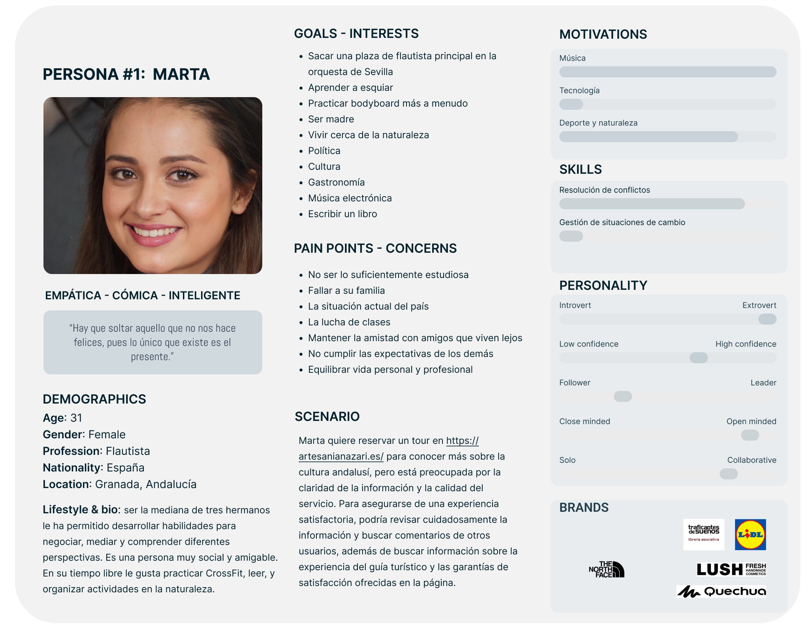
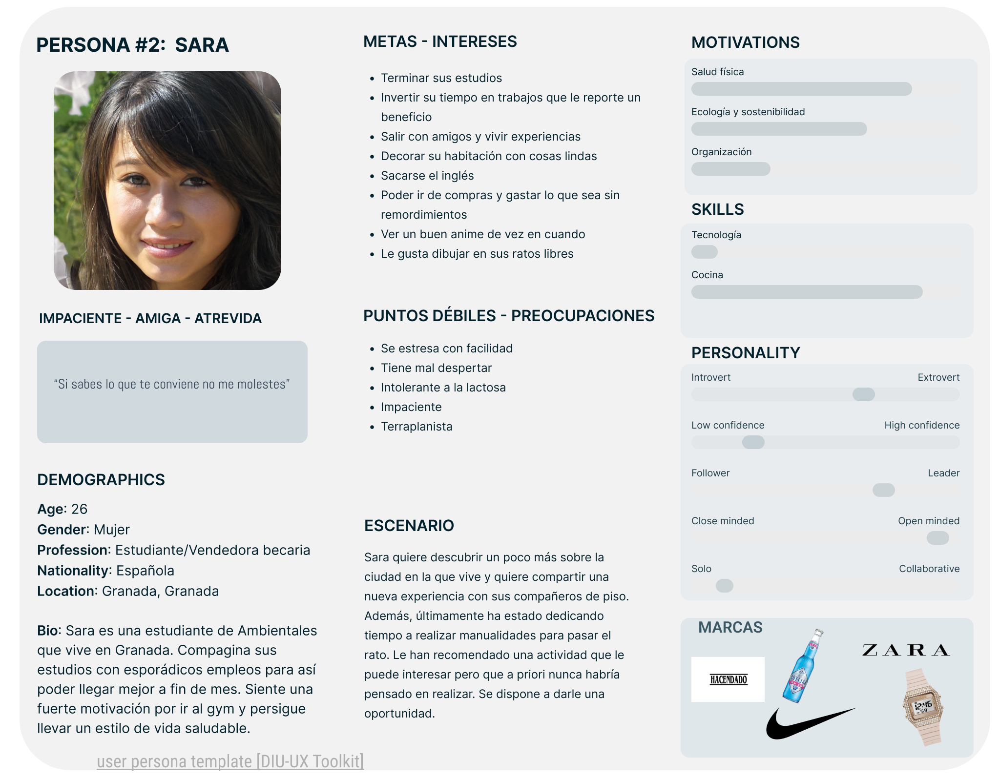
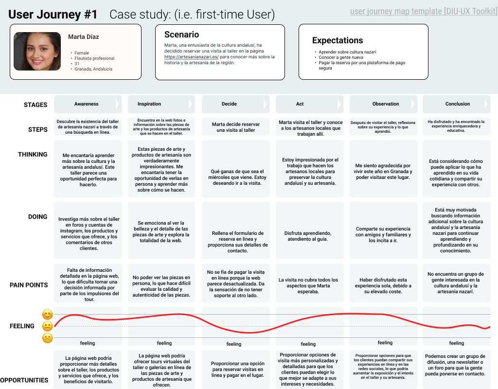
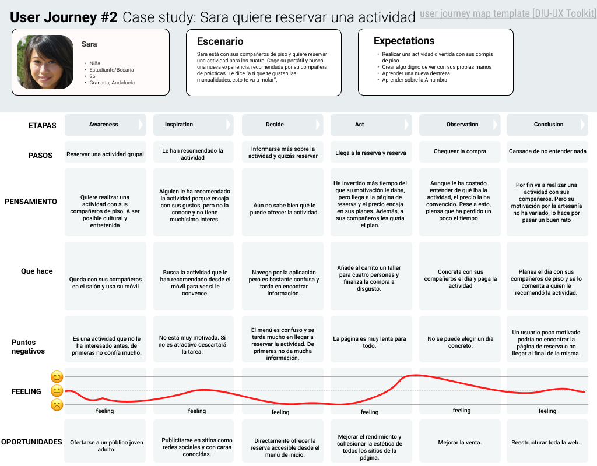

## DIU - Practica1, entregables

1 Empathy map
-----

2 Competitive Analysis
-----

El tema del analisis se centra en proyectos enfocados al __Turismo__. Hemos elegido Teller de arteseania al pertenecer al grupo 3. Se va a acomparar con las otras ofertas turisticas Free Tour y Tablao

3 Persona
-----

Hemos elegido dos personas jovenes que encajan con nuestro entorno estudiantil mas carcano. Estas dos personas son fisticias inspiradas en personas reales, Sara y Marta.

4 User Journey Map
----

Hemos modelado una situción distinta para cada usuario que consideramos posibles y reales para un publico mas joven.

5 Usability Review
----
- [Enlace al documento](Usability-review.xls)
- Valoración final: __38 Poor__

### BRIEFING

__Problemas de diseño y navegación. Confusión sobre el propósito de la web. Necesita mejoras en el proceso de compra.__
