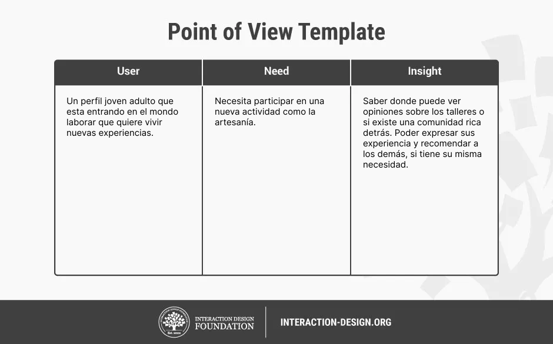
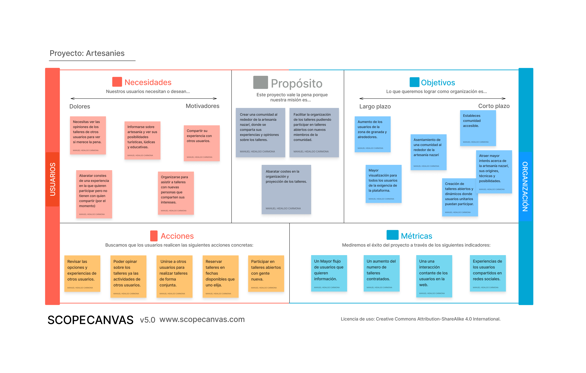
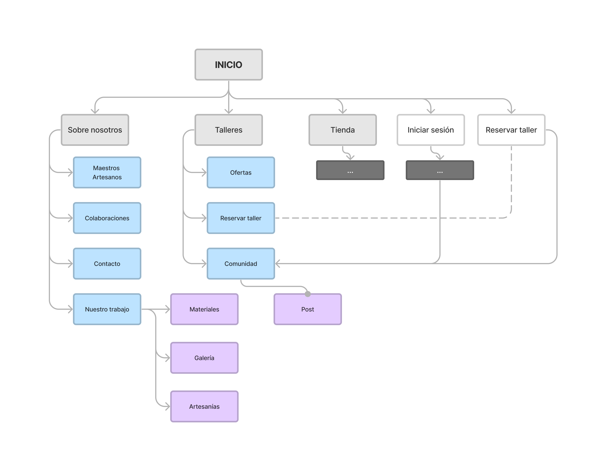
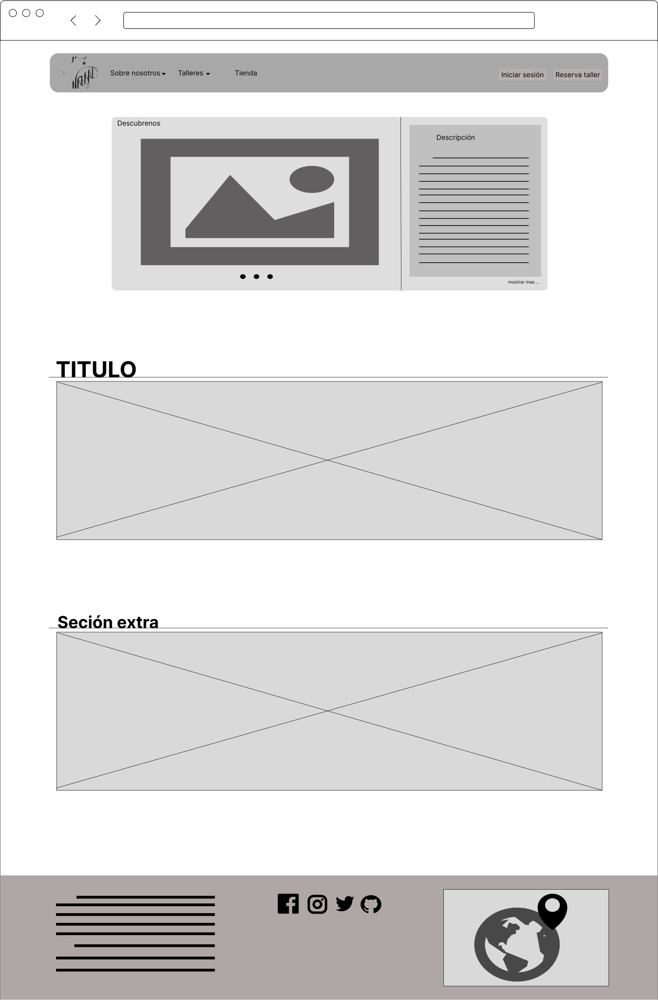
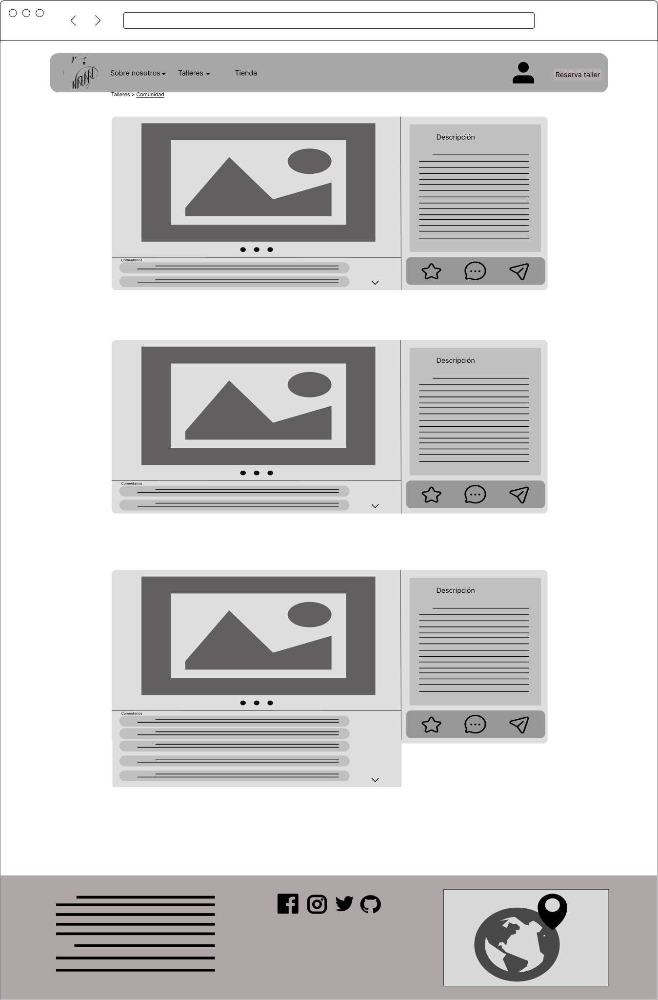

# Practica2. DISEÑO DE BOCETOS: Propuesta de Valor sobre negocio turístico

En esta etapa nos centraremos en dar una propuesta de valor al caso de estudio de artesanías nazaríes. Para ello nos vamos a centrar en la interacción de los usuarios creados en la etapa anterior. Se buscará los puntos fuertes y conceptos a mejorar del sitio, concluyendo con una propuesta de valor y un diseño preliminar de baja fidelidad.

---

Proyecto: **NazaLine**

**NazaLine** representa la línea de las artesanías nazaríes, un camino que queremos recorrer junto a una comunidad entusiasta que quiere compartir y mantener las Artesanías Nazaríes. 

Descripción: 

Queremos fomentar el sentimiento de comunidad por ello proponemos expandir ese concepto y solventar además un problema. Los usuarios normalmente quieren información acerca de los talleres, si les va a gustar, saber experiencias de otros usuarios etc. Queremos dar la posibilidad a los usuarios de expresar sus vivencias en los talleres, crearemos un entorno donde los usuarios puedan postear sus obras y opinar sobre los talleres y las artesanías que hagan. Además de crear grupos abiertos de talleres donde los usuarios de la comunidad puedan participar, conocerse y también abaratar el coste de los talleres.

---

## Ideación. 

Obtenemos los objetivos e ideas que queremos desarrollar a través de la malla receptora de ideas.

### - Malla receptora de información

### - Punto de vista

Como complemento y para obtener mas información hacemos uso de los usuarios para ver su punto de vista y que necesitan.

---

## PROPUESTA DE VALOR

Utilizamos esta herramienta porque nos ofrece una **visión  general** de los problemas que podemos resolver del sitio y nuevas ideas que podemos desarrollar.
Vemos que uno de los problemas es que no podemos ver las valoraciones de los talleres y con ese problema obtenemos la idea de crear una **TimeLine o comunidad** donde podamos solucionar ese problema. Además fomenta que se comparta el taller y la artesania nazari.

También sacamos algunos defecto de diseños que mejoraremos en las siguientes etapas.

**En conclusión** la propuesta se basa en crear una **comunidad**  un sitio donde los usuarios puedan **postear** sus obras y **valorar** los talleres y las obras de los demás. Además con esta comunidad se podrá asistir a talleres abiertos para todos.

---

### TASK ANALYSIS

Análisis de las tareas mas realizadas dentro de los 3 grupos de usuarios que vamos a definir:
- **Contratan talleres**: Usuarios que ya han contratado un taller o tienen la intención de hacerlo y forman parte de la comunidad
- **Curiosos por artesanía**: Usuarios que buscan información por artesanía como estudiantes, profesores, artesanos.
- **Curiosos por el taller**: usuarios que nunca han reservado un taller.

|     **_Usuario\  Tareas_**    	| **Contratan talleres** 	| **Curiosos por artesanía** 	| **Curiosos por el teller** 	|
|:--------------------------------------------	|:----------------------:	|:--------------------------:	|:--------------------------:	|
|              **iniciar sesión**             	|            H           	|              L             	|              L             	|
|    **Busca información  de artesanía**   	|            H           	|              H             	|              M             	|
|      **Busca información  de taller**     	|            H           	|              M             	|              H             	|
|               **Busca ofertas**              	|            H           	|              L             	|              H             	|
|         **Busca  colaboraciones**         	|            M           	|              M             	|              M             	|
|          **Publicar su experiencia**         	|            M           	|              L             	|              L             	|
| **Revisar la experiencia de otros usuarios** 	|            H           	|              L             	|              H             	|
|              **Reservar taller**             	|            H           	|              L             	|              H             	|
|              **Cancelar Taller**             	|            M           	|             NA             	|              L             	|
|             **Modificar Taller**             	|            H           	|             NA             	|              L             	|

---

## ARQUITECTURA DE INFORMACIÓN

### Site Map

### Labelling 

| **_Labeling_**            | **_Descripción_**     |
|------------------------   |-------------------    |
| **Inicio**                | Portada y entrada al sitio. |
| **Sobre nosostros**       | Explicación de taller a nivel profesional y explicación de organización empresarial. |
| **Maestros Artesanos**    | Explicación sobre métodos, herramientas y maestros artesanos dentro del taller y dentro de la organización. |
| **Colaboraciones**        | Exposición de colaboraciones y trabajos hechos desde el taller. Los trabajos realizados a otras empresas e identidades. |
| **Contacto**              | Formularios y datos de contacto. |
| **Nuestro trabajo**       | Los trabajos realizados dentro de la organización.  |
| **Materiales**            | Mas información acerca de los materiales. |
| **Galería**               | Todos los complementos de videos y fotos. |
| **Artesanías**            | Mas información acerca de las artesanías. |
| **Talleres**              | Explicación sobre los talleres. |
| **Ofertas**               | Dentro de los talleres que ofertas se ofrecen. |
| **Reservar taller**       | Punto de reserva y gestión de los talleres. |
| **Comunidad**             | Portal donde se pueden ver todas las publicaciones y comentarios de los usuarios. |
| **Tienda**                | Enlace de la aplicación de artesanías nazaríes. |
| **Iniciar sesión**        | inicio de sesión y gestión de usuarios. |

### Prototipo Lo-FI Wireframe 

Hemos creado 4 vistas de la página de inicio y comunidad en web y móvil.

- **Inicio**: hemos creado una barra de navegación sencilla compuesta por los puntos destacados en el site map. Para representar la llamada a la acción hemos apartado el acceso al login y a reserva de talleres en dos botones resaltando su importancia. También tenemos un carrusel con información relevante de los distintos sitios de la web que recogemos todos los videos y documentos que antes estaban dispersos.

- **Comunidad**: en la vista de comunidad vemos todos los pos que se han hecho por parte de los usuarios. Cada post tiene una parte de imágenes, otra de descripción. En la parte inferior del post vemos comentarios y valoraciones y acciones (compartir, comentar) por parte de otros usuarios

- Inicio

- Comunidad

- Inicio (smartphone)

    

- comunidad (smartphone)

    

---

## Conclusiones  

Hemos podido crear una propuesta que además solventa uno de los problemas que tenía el sitio. Esta propuesta está centrada en fomentar el turismo que es el eje central del proyecto