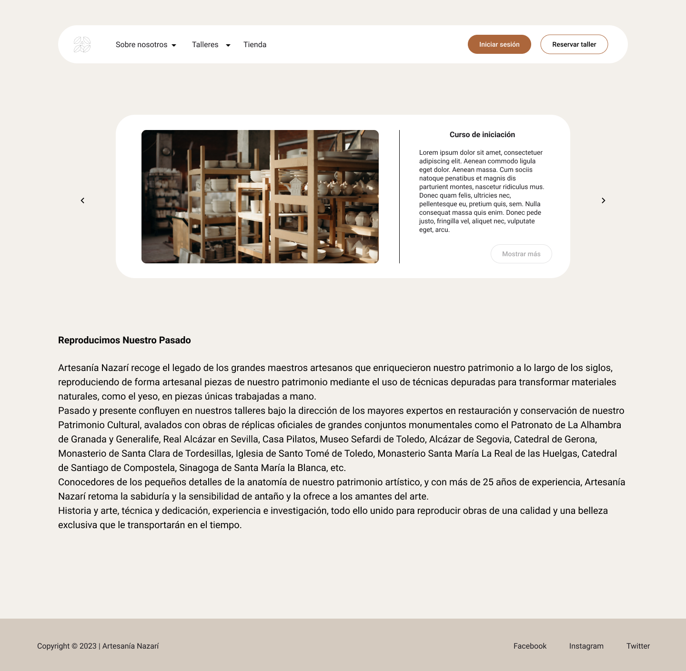

# DIU - Practica 3, entregables

## Moodboard (diseño visual + logotipo)   

### __LOGO__

    

### __MoodBoard__

    

## Landing Page

## Guidelines

Patrón de diseño de la rejilla: La web se ha estructurado utilizando un patrón de rejilla para lograr una disposición organizada y equilibrada de los elementos. Esta elección representa la atención meticulosa y el cuidado que los artesanos ponen en cada una de sus creaciones. Al igual que una rejilla proporciona una estructura estable para construir sobre ella, la rejilla en la web brinda una sensación de orden y armonía.

Patrón de diseño de tarjetas: Las tarjetas se han utilizado para presentar las diferentes creaciones y productos artesanales en la web. Estas tarjetas permiten una presentación visual clara y concisa de cada artículo, mostrando una imagen representativa y una breve descripción. Además, las tarjetas facilitan la navegación y la comparación de productos, brindando a los usuarios una experiencia intuitiva y cómoda al explorar las opciones disponibles.

Patrón de diseño de scroll parallax: Al desplazarse por la página, se ha implementado un efecto de scroll parallax en ciertos elementos, como imágenes de fondo o secciones destacadas. Este efecto agrega una sensación de profundidad y dinamismo a la página, creando una experiencia visualmente atractiva y envolvente. Además, el scroll parallax resalta la atención al detalle y la artesanía meticulosa que se refleja en cada obra.

Estos patrones de diseño han sido seleccionados para realzar la experiencia del usuario y transmitir los valores de artesanía, claridad y pureza presentes en la web https://artesanianazari.es/. Cada patrón ha sido adaptado estratégicamente para lograr una presentación visual armoniosa y una navegación intuitiva, lo que mejora la interacción de los usuarios y la apreciación de las creaciones artesanales.

## Mockup: LAYOUT HI-FI

### Vista comunidad

### Vista Inicio iPhone

    

### Vista Cominuidad iPhone

    

## Documentación: Publicación del Case Study

El rediseño del sitio web https://artesanianazari.es/ se ha centrado en transmitir los conceptos de artesanía, claridad y pureza. Para lograr esto, se han implementado varios elementos y decisiones de diseño.

En cuanto a la paleta de colores, se ha elegido una combinación de gris, terracota y beige. Estos colores se seleccionaron por su neutralidad y pureza. El beige y el terracota hacen referencia a la cerámica y al barro, elementos tradicionales de la artesanía. El gris oscuro, casi negro, se ha utilizado para representar la elegancia del negro, pero de una manera más suavizada.

Los iconos utilizados en el sitio web provienen de la librería de material. Estos iconos son lineales y sencillos, lo que los hace coherentes con el resto de los elementos de diseño. Esta elección contribuye a la claridad y la simplicidad visual del sitio.

Una característica destacada del rediseño es la inclusión de un timeline para crear comunidad. Este timeline permite a los alumnos y usuarios del sitio web publicar sus creaciones y dar feedback a otros compañeros. Esta funcionalidad fomenta la interacción y la participación de la comunidad, fortaleciendo así la conexión entre los usuarios y la artesanía.