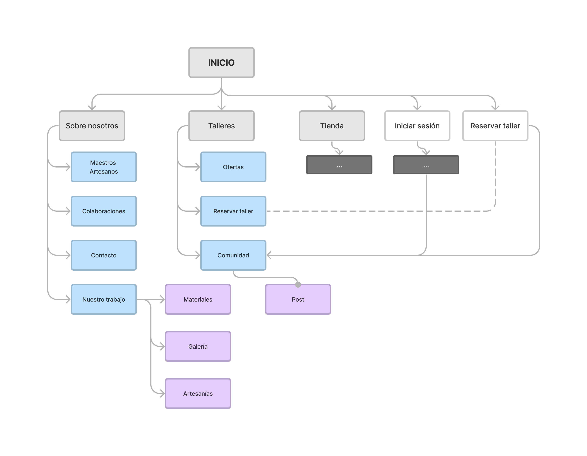

# DIU23
Prácticas Diseño Interfaces de Usuario 2022-23 (Tema: Turirmos ) 

Grupo: DIU1_0Ahora-o-nunca.  Curso: 2022/23 
Updated: 02/05/2023

Proyecto: **NazaLine**

**NazaLine** representa la línea de las artesanías nazaríes, un camino que queremos recorrer junto a una comunidad entusiasta que quiere compartir y mantener las Artesanías Nazaríes. 

Descripción: 

Queremos fomentar el sentimiento de comunidad por ello proponemos expandir ese concepto y solventar además un problema. Los usuarios normalmente quieren información acerca de los talleres, si les va a gustar, saber experiencias de otros usuarios etc. Queremos dar la posibilidad a los usuarios de expresar sus vivencias en los talleres, crearemos un entorno donde los usuarios puedan postear sus obras y opinar sobre los talleres y las artesanías que hagan. Además de crear grupos abiertos de talleres donde los usuarios de la comunidad puedan participar, conocerse y también abaratar el coste de los talleres.

Logotipo: 

    

Miembros
 * :bust_in_silhouette:   [Manuel Hidalgo Carmona](https://github.com/venrra)     :octocat:     
 * :bust_in_silhouette:  [Maria Forencio](https://github.com/mariafd412)     :octocat:

----- 

# Proceso de Diseño 

## Paso 1. UX Desk Research & Analisis 

 1.a Competitive Analysis
-----

El tema del analisis se centra en proyectos enfocados al __Turismo__. Hemos elegido Teller de arteseania al pertenecer al grupo 3. Se va a acomparar con las otras ofertas turisticas Free Tour y Tablao

 1.b Persona
-----

Hemos elegido dos personas jovenes que encajan con nuestro entorno estudiantil mas carcano. Estas dos personas son fisticias inspiradas en personas reales, Sara y Marta.

 1.c User Journey Map
----

Hemos modelado una situción distinta para cada usuario que consideramos posibles y reales para un publico mas joven.

 1.d Usability Review
----
- [Enlace al documento](./P1/Usability-review.xlsx)
- Valoración final: __38 Poor__

### BRIEFING

__Problemas de diseño y navegación. Confusión sobre el propósito de la web. Necesita mejoras en el proceso de compra.__

## Paso 2. UX Design  

 2.a Feedback Capture Grid / POV
----

Obtenemos los objetivos e ideas que queremos desarrollar a través de la malla receptora de ideas.

Utilizamos esta herramienta 

### - Malla receptora de información

### - Punto de vista

Como complemento y para obtener mas información hacemos uso de los usuarios para ver su punto de vista y que necesitan.

 2.b ScopeCanvas
----

Utilizamos esta herramienta porque nos ofrece una **visión  general** de los problemas que podemos resolver del sitio y nuevas ideas que podemos desarrollar.
Vemos que uno de los problemas es que no podemos ver las valoraciones de los talleres y con ese problema obtenemos la idea de crear una **TimeLine o comunidad** donde podamos solucionar ese problema. Además fomenta que se comparta el taller y la artesania nazari.

También sacamos algunos defecto de diseños que mejoraremos en las siguientes etapas.

**En conclusión** la propuesta se basa en crear una **comunidad**  un sitio donde los usuarios puedan **postear** sus obras y **valorar** los talleres y las obras de los demás. Además con esta comunidad se podrá asistir a talleres abiertos para todos.

 2.b Tasks analysis 
-----

Análisis de las tareas mas realizadas dentro de los 3 grupos de usuarios que vamos a definir:
- **Contratan talleres**: Usuarios que ya han contratado un taller o tienen la intención de hacerlo y forman parte de la comunidad
- **Curiosos por artesanía**: Usuarios que buscan información por artesanía como estudiantes, profesores, artesanos.
- **Curiosos por el taller**: usuarios que nunca han reservado un taller.

|     **_Usuario\  Tareas_**    	| **Contratan talleres** 	| **Curiosos por artesanía** 	| **Curiosos por el teller** 	|
|:--------------------------------------------	|:----------------------:	|:--------------------------:	|:--------------------------:	|
|              **iniciar sesión**             	|            H           	|              L             	|              L             	|
|    **Busca información  de artesanía**   	|            H           	|              H             	|              M             	|
|      **Busca información  de taller**     	|            H           	|              M             	|              H             	|
|               **Busca ofertas**              	|            H           	|              L             	|              H             	|
|         **Busca  colaboraciones**         	|            M           	|              M             	|              M             	|
|          **Publicar su experiencia**         	|            M           	|              L             	|              L             	|
| **Revisar la experiencia de otros usuarios** 	|            H           	|              L             	|              H             	|
|              **Reservar taller**             	|            H           	|              L             	|              H             	|
|              **Cancelar Taller**             	|            M           	|             NA             	|              L             	|
|             **Modificar Taller**             	|            H           	|             NA             	|              L             	|

 2.c IA: Sitemap + Labelling 
----

### Site Map

Gracias al análisis de tareas podemos expresar el siguiente site map

### Labelling

| **_Labeling_**            | **_Descripción_**     |
|------------------------   |-------------------    |
| **Inicio**                | Portada y entrada al sitio. |
| **Sobre nosostros**       | Explicación de taller a nivel profesional y explicación de organización empresarial. |
| **Maestros Artesanos**    | Explicación sobre métodos, herramientas y maestros artesanos dentro del taller y dentro de la organización. |
| **Colaboraciones**        | Exposición de colaboraciones y trabajos hechos desde el taller. Los trabajos realizados a otras empresas e identidades. |
| **Contacto**              | Formularios y datos de contacto. |
| **Nuestro trabajo**       | Los trabajos realizados dentro de la organización.  |
| **Materiales**            | Mas información acerca de los materiales. |
| **Galería**               | Todos los complementos de videos y fotos. |
| **Artesanías**            | Mas información acerca de las artesanías. |
| **Talleres**              | Explicación sobre los talleres. |
| **Ofertas**               | Dentro de los talleres que ofertas se ofrecen. |
| **Reservar taller**       | Punto de reserva y gestión de los talleres. |
| **Comunidad**             | Portal donde se pueden ver todas las publicaciones y comentarios de los usuarios. |
| **Tienda**                | Enlace de la aplicación de artesanías nazaríes. |
| **Iniciar sesión**        | inicio de sesión y gestión de usuarios. |

 2.d Wireframes
-----

Hemos creado 4 vistas de la página de inicio y comunidad en web y móvil.

- **Inicio**: hemos creado una barra de navegación sencilla compuesta por los puntos destacados en el site map. Para representar la llamada a la acción hemos apartado el acceso al login y a reserva de talleres en dos botones resaltando su importancia. También tenemos un carrusel con información relevante de los distintos sitios de la web que recogemos todos los videos y documentos que antes estaban dispersos.

- **Comunidad**: en la vista de comunidad vemos todos los pos que se han hecho por parte de los usuarios. Cada post tiene una parte de imágenes, otra de descripción. En la parte inferior del post vemos comentarios y valoraciones y acciones (compartir, comentar) por parte de otros usuarios

- Inicio

- Comunidad

- Inicio (smartphone)

    

- comunidad (smartphone)

    

## Paso 3. Mi UX-Case Study (diseño)

 3.a Moodboard
-----

### __LOGO__

    

### __MoodBoard__

    

  3.b Landing Page
----

>>> Plantear Landing Page 

 3.c Guidelines
----

Patrón de diseño de la rejilla: La web se ha estructurado utilizando un patrón de rejilla para lograr una disposición organizada y equilibrada de los elementos. Esta elección representa la atención meticulosa y el cuidado que los artesanos ponen en cada una de sus creaciones. Al igual que una rejilla proporciona una estructura estable para construir sobre ella, la rejilla en la web brinda una sensación de orden y armonía.

Patrón de diseño de tarjetas: Las tarjetas se han utilizado para presentar las diferentes creaciones y productos artesanales en la web. Estas tarjetas permiten una presentación visual clara y concisa de cada artículo, mostrando una imagen representativa y una breve descripción. Además, las tarjetas facilitan la navegación y la comparación de productos, brindando a los usuarios una experiencia intuitiva y cómoda al explorar las opciones disponibles.

Patrón de diseño de scroll parallax: Al desplazarse por la página, se ha implementado un efecto de scroll parallax en ciertos elementos, como imágenes de fondo o secciones destacadas. Este efecto agrega una sensación de profundidad y dinamismo a la página, creando una experiencia visualmente atractiva y envolvente. Además, el scroll parallax resalta la atención al detalle y la artesanía meticulosa que se refleja en cada obra.

Estos patrones de diseño han sido seleccionados para realzar la experiencia del usuario y transmitir los valores de artesanía, claridad y pureza presentes en la web https://artesanianazari.es/. Cada patrón ha sido adaptado estratégicamente para lograr una presentación visual armoniosa y una navegación intuitiva, lo que mejora la interacción de los usuarios y la apreciación de las creaciones artesanales.

  3.d Mockup
----

### Vista Inicio iPhone

    

### Vista Cominuidad iPhone

    

 3.e ¿My UX-Case Study?
-----

El rediseño del sitio web https://artesanianazari.es/ se ha centrado en transmitir los conceptos de artesanía, claridad y pureza. Para lograr esto, se han implementado varios elementos y decisiones de diseño.

En cuanto a la paleta de colores, se ha elegido una combinación de gris, terracota y beige. Estos colores se seleccionaron por su neutralidad y pureza. El beige y el terracota hacen referencia a la cerámica y al barro, elementos tradicionales de la artesanía. El gris oscuro, casi negro, se ha utilizado para representar la elegancia del negro, pero de una manera más suavizada.

Los iconos utilizados en el sitio web provienen de la librería de material. Estos iconos son lineales y sencillos, lo que los hace coherentes con el resto de los elementos de diseño. Esta elección contribuye a la claridad y la simplicidad visual del sitio.

Una característica destacada del rediseño es la inclusión de un timeline para crear comunidad. Este timeline permite a los alumnos y usuarios del sitio web publicar sus creaciones y dar feedback a otros compañeros. Esta funcionalidad fomenta la interacción y la participación de la comunidad, fortaleciendo así la conexión entre los usuarios y la artesanía.

## Paso 4. Evaluación 

 4.a Caso asignado
----

>>> Breve descripción del caso asignado con enlace a  su repositorio Github

 4.b User Testing
----

>>> Seleccione 4 personas ficticias. Exprese las ideas de posibles situaciones conflictivas de esa persona en las propuestas evaluadas. Asigne dos a Caso A y 2 al caso B
 

| Usuarios | Sexo/Edad     | Ocupación   |  Exp.TIC    | Personalidad | Plataforma | TestA/B
| ------------- | -------- | ----------- | ----------- | -----------  | ---------- | ----
| User1's name  | H / 18   | Estudiante  | Media       | Introvertido | Web.       | A 
| User2's name  | H / 18   | Estudiante  | Media       | Timido       | Web        | A 
| User3's name  | M / 35   | Abogado     | Baja        | Emocional    | móvil      | B 
| User4's name  | H / 18   | Estudiante  | Media       | Racional     | Web        | B 

. 4.c Cuestionario SUS
----

>>> Usaremos el **Cuestionario SUS** para valorar la satisfacción de cada usuario con el diseño (A/B) realizado. Para ello usamos la [hoja de cálculo](https://github.com/mgea/DIU19/blob/master/Cuestionario%20SUS%20DIU.xlsx) para calcular resultados sigiendo las pautas para usar la escala SUS e interpretar los resultados
http://usabilitygeek.com/how-to-use-the-system-usability-scale-sus-to-evaluate-the-usability-of-your-website/)
Para más información, consultar aquí sobre la [metodología SUS](https://cui.unige.ch/isi/icle-wiki/_media/ipm:test-suschapt.pdf)

>>> Adjuntar captura de imagen con los resultados + Valoración personal 

 4.d Usability Report
----

>> Añadir report de usabilidad para práctica B (la de los compañeros)

>>> Valoración personal 

>>> ## Paso 5. Evaluación de Accesibilidad  (no necesaria)

>>>   5.a Accesibility evaluation Report 
>>>> ----

>>> Indica qué pretendes evaluar (de accesibilidad) sobre qué APP y qué resultados has obtenido 

>>> 5.a) Evaluación de la Accesibilidad (con simuladores o verificación de WACG) 
>>> 5.b) Uso de simuladores de accesibilidad 

>>> (uso de tabla de datos, indicar herramientas usadas) 

>>> 5.c Breve resumen del estudio de accesibilidad (de práctica 1) y puntos fuertes y de mejora de los criterios de accesibilidad de tu diseño propuesto en Práctica 4.

## Conclusión final / Valoración de las prácticas

>>> (90-150 palabras) Opinión del proceso de desarrollo de diseño siguiendo metodología UX y valoración (positiva /negativa) de los resultados obtenidos  

